#  CSE-464-2023-tchen128

## Getting Started

These instructions will help you get the project up and running on your local machine.

### Prerequisites

- Java Development Kit (JDK) 1.8 or later
- Apache Maven (Maven is used for building and managing dependencies)

### Installing

1. Clone the repository to your local machine:

    ```bash
    git clone https://github.com/welldonepig/CSE-464-2023-tchen128.git
    ```

2. Navigate to the project directory:

    ```bash
    cd project-directory
    ```

3. Build the project using Maven:

    ```bash
    mvn clean install
    ```

4. Run package command:

    ```bash
    mvn package
    ```

### Running the Application

After you have successfully built the project, you can run the application using the following command:

    mvn exec:java -Dexec.mainClass="org.parser.GraphParser"


### Run unit tests

    mvn test

## Instruction And Example

**1. Run these test cases in GraphParserTest.java to test 3 new API**
- testRemoveNode 
- testRemoveNonExistentNode
- testRemoveNodes
- testRemoveNonExistentNodeInListNodes
- removeEdge
- testRemoveNonExistentEdge
- testRemoveNonExistentEdgeBetweenExistingNodes

**removeNode(String label)**  
  Input:  
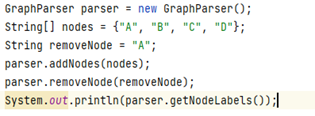  
  Output:  
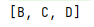  

**removeNodes(String[] labels)**  
Input:  
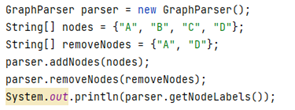  
Output:  
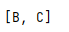  

**removeEdge(String srcLabel, String dstLabel)**  
Input:  
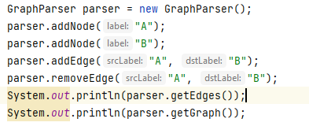  
Output:   
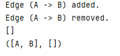  

**2. Link and picture for GitHub Action integrated into repository**  

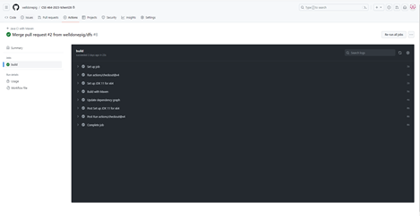


Link GitHub Action: [GitHub Action auto run](https://github.com/welldonepig/CSE-464-2023-tchen128/actions/runs/6743321937)  
Link commit: [commit](https://github.com/welldonepig/CSE-464-2023-tchen128/commit/711db0c051950d74eec4acfedb8b2f555e7ffd89)

**3. BFS**  
Link PR: [BFS](https://github.com/welldonepig/CSE-464-2023-tchen128/pull/1)  
Input:  
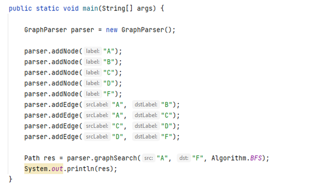
Output:   
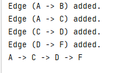

**4. DFS**  
Link PR: [DFS](https://github.com/welldonepig/CSE-464-2023-tchen128/pull/2)  
Input:  
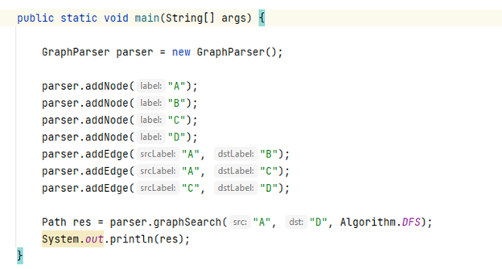
Output:   
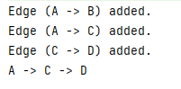  

**5. Merge bfs then merge dfs branch change search api with enum Algorithm**   
[Link resolve conflict and merge](https://github.com/welldonepig/CSE-464-2023-tchen128/commit/d22dbbcc08879a94d73d11deb318d0776e9d846b)